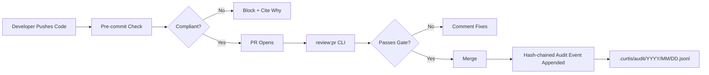

# 🛡️ Curtis Compliance

> Open-source compliance checks for fintech code — pre-commit, PR review, and a
> hash-chained audit trail you can hand to your SOC2 / PCI-DSS auditor.

[](https://www.npmjs.com/package/@jordannewell/curtis-compliance)
[](LICENSE)

Curtis Compliance scans your diff for things regulators care about — plaintext
secrets, non-TLS calls, missing audit logs, unencrypted sensitive data,
unvalidated user input — and either lets the commit through or blocks it with
the specific HIPAA / SOC2 / PCI-DSS citation it would fail an audit on.

Every check produces a timestamped, hash-chained event in a local JSONL log.
Tamper with a historical event and the chain breaks. Export it as CSV and hand
it to your auditor. That's the whole product.

## Why Curtis Compliance?

**Fintech teams spend 40% of their time on compliance paperwork.**

Curtis automates the part that lives in the code:

- ✅ Pre-commit compliance gate (blocks non-compliant commits locally)
- ✅ One-shot PR review via CLI + GitHub PAT
- ✅ Hash-chained, tamper-evident audit trail on disk
- ✅ CSV / JSON evidence export for SOC2 / PCI-DSS auditors
- ✅ HIPAA, SOC2, and PCI-DSS framework presets with real citations

## How It Works



Every check produces a tamper-evident event — see
[Audit Trail](#3-audit-trail--tamper-evidence) below.

## Quick Start

```bash
# Install
npm install -g @jordannewell/curtis-compliance

# Initialize in your repo
curtis-compliance init --framework pci-dss

# Commit like normal
git add .
git commit -m "feat: add payment processing"

# Curtis runs as a pre-commit hook and writes an audit event automatically.
# Non-compliant commits are blocked with the specific citation they fail:
#
#   ❌ no-secrets-in-code
#      🔴 Found 2 potential secret(s) in code. Use environment variables.
#      → src/payments/stripe.ts:42
```

## Features

### 1. Pre-commit Compliance Gate

```yaml
# .curtis/compliance.yaml
framework: pci-dss
blockOnFailure: true
auditTrail: true
skipPatterns:
  - node_modules/**
  - dist/**

rules:
  no-secrets-in-code:   { enabled: true,  blockOnFail: true  }
  tls-only:             { enabled: true,  blockOnFail: false }
  audit-logging:        { enabled: true,  blockOnFail: false }
  encryption-at-rest:   { enabled: true,  blockOnFail: true  }
  input-validation:     { enabled: true,  blockOnFail: false }
```

Disable any rule by setting `enabled: false`. The check result will report
`skip` with a clear "Rule disabled in config" message.

### 2. PR Compliance Reviews

Trigger a one-off review of any PR using a GitHub PAT (requires `repo` scope):

```bash
export GITHUB_TOKEN=ghp_xxx

curtis-compliance review:pr 42 \
  --owner acme \
  --repo payments \
  --framework pci-dss
```

Curtis fetches the PR diff, runs the same checks, posts a review comment,
and sets the commit status:

```markdown
## 🔍 Curtis Compliance Review

**Framework:** `PCI-DSS` | **Status:** ❌ **NON-COMPLIANT**

| Check | Status | Severity | Details |
|-------|--------|----------|----------|
| no-secrets-in-code | ❌ FAIL | 🔴 CRITICAL | Found 2 potential secret(s). [`src/payments.ts:42`](...) |
| tls-only | ✅ PASS | 🟠 HIGH | All external calls use HTTPS/TLS |
| audit-logging | ❌ FAIL | 🟠 HIGH | Sensitive operations detected but no audit logging found |
| input-validation | ⚠️ WARN | 🟡 MEDIUM | User input detected but validation not confirmed |

### 📋 Action Required

This PR is **not compliant**. Please address the issues above before merging.
```

For automatic PR reviews on every push, wire `handlePRWebhook` (exported from
`src/github-integration.ts`) into your own GitHub App or CI worker. A hosted
Curtis App is on the roadmap — see [Roadmap](#roadmap).

### 3. Audit Trail + Tamper Evidence

Every `curtis-compliance check` and `report` writes one event to an append-only,
hash-chained JSONL log. One file per day at
`.curtis/audit/YYYY/MM/YYYY-MM-DD.jsonl`.

```json
{
  "timestamp": "2026-07-20T17:50:41.259Z",
  "event_id": "db8579a6-971f-4a98-bf1c-32ff7db7a58f",
  "event_type": "compliance_check",
  "framework": "pci-dss",
  "repo": "acme/payments",
  "commit": "abc123",
  "author": "JordanNewell",
  "branch": "main",
  "overall_status": "non-compliant",
  "checks": [
    { "requirement": "no-secrets-in-code", "status": "fail", "severity": "critical", "file": "src/payments.ts", "line": 42 },
    { "requirement": "tls-only", "status": "pass", "severity": "high" }
  ],
  "summary": { "critical": 1, "high": 0, "medium": 0, "low": 0, "total": 5 },
  "curtis_version": "1.1.0",
  "prev_hash": "a7192de26a7e8c1d4f5b..."
}
```

Each event's `prev_hash` is the SHA-256 of the prior event's canonical JSON.
Any modification to a historical event breaks the chain and is detected by:

```bash
$ curtis-compliance audit verify
✅ Audit chain intact (142 events verified).
```

If someone tampers with an old event, the next `audit verify` exits non-zero
with the exact line and the broken hash:

```
❌ Audit chain broken at line 87:
   prev_hash mismatch: expected a7192de26a7e…, got 924075dbbff0…
   event_id: 83024baa-8382-405b-a30a-f0e9f3a98fa8
   86 events verified before break.
```

#### Export for auditors

SOC2 / PCI-DSS auditors want CSV. Curtis ships it:

```bash
# Export everything as CSV
curtis-compliance audit export --format csv > evidence.csv

# Filter by date range + framework
curtis-compliance audit export \
  --since 2026-01-01 \
  --until 2026-06-30 \
  --framework pci-dss \
  --format csv \
  -o pci-evidence-h1.csv

# JSON for programmatic consumers
curtis-compliance audit export --format json
```

CSV columns: `timestamp, event_id, framework, repo, commit, author, branch,
overall_status, critical, high, medium, low, total`. RFC-4180 compliant
(quotes/commas/newlines escaped).

#### Tail recent events

```bash
$ curtis-compliance audit tail -n 5
2026-07-20T17:50:41Z  pci-dss   non-compliant  acme/payments
2026-07-20T16:12:03Z  pci-dss   compliant      acme/payments
2026-07-20T14:33:09Z  hipaa     partial        acme/health-api
...
```

**Disable the audit trail** by setting `auditTrail: false` in
`.curtis/compliance.yaml`.

### 4. Framework Citations

Built-in rules map to real compliance citations — when Curtis blocks a commit,
it tells you which specific requirement would fail an audit.

**HIPAA:**
- §164.312(a)(1) — Access controls
- §164.312(a)(2)(iv) — Encryption and decryption (encryption-at-rest rule)
- §164.312(b) — Audit controls (audit-logging rule)
- §164.312(e)(1) — Transmission security (tls-only rule)

**PCI-DSS:**
- 3.4 — Render PAN unreadable (encryption-at-rest rule)
- 4.1 — Use strong cryptography (tls-only rule)
- 6.5.1 — Input validation (input-validation rule)
- 10.2 — Implement audit trails (audit-logging rule)

**SOC2:**
- CC6.1 — Logical and physical access controls
- CC7.2 — System monitoring

### 5. Secret Detection

The `no-secrets-in-code` rule recognizes 21 patterns across 12 providers:

- **Cloud:** AWS access keys (`AKIA…`), Google API keys (`AIza…`)
- **LLM:** OpenAI legacy + project, OpenRouter, Anthropic
- **VCS:** GitHub PAT/App/OAuth/refresh, GitLab PATs
- **Payments:** Stripe live secret + restricted live
- **Chat:** Slack token family (`xox[baprs]-…`)
- **Generic:** `password =`, `api_key =`, `secret_key =`, `token =`,
  PEM private key blocks (RSA/EC/DSA/OpenSSH/PGP)

## Installation

```bash
npm install -g @jordannewell/curtis-compliance
```

Requires Node 18+.

If you prefer not to install globally, `npx` works:

```bash
npx @jordannewell/curtis-compliance init --framework pci-dss
```

## Roadmap

**Shipped:**
- [x] Pre-commit gate with framework-aware citations
- [x] Hash-chained audit trail with tamper evidence
- [x] CSV / JSON evidence export
- [x] `review:pr` CLI (PAT-based, posts comment + commit status)
- [x] Per-rule enable/disable via `.curtis/compliance.yaml`
- [x] Secret detection across 12 providers

**Not built yet (no timeline promises):**
- [ ] Hosted GitHub App for automatic PR reviews without PAT setup
- [ ] VS Code extension
- [ ] GitLab / Bitbucket support
- [ ] Custom compliance frameworks (beyond the three presets)
- [ ] PDF report export
- [ ] Slack / Teams notifications
- [ ] AWS / Azure / GCP policy checks
- [ ] Compression of audit files older than 30 days

There is intentionally **no paid tier**, **no SaaS dashboard**, and
**no hosted offering**. Curtis Compliance is open-source software you run on
your own machine. If a hosted version makes sense in the future, it will be
announced when it exists — not before.

## What's not in this project

A few things explicitly **do not exist**, in case you saw an old version of
this README:

- **No GitHub App.** The `review:pr` CLI is the only PR-review path today.
- **No Docker image.** `docker run curtis/compliance` does nothing — there's
  no image published.
- **No `curtis.ai` website.** That domain belongs to an unrelated party.
  This project lives at
  [github.com/JordanNewell/curtis-compliance](https://github.com/JordanNewell/curtis-compliance).
- **No pricing tiers.** Everything that exists is MIT-licensed and free.
- **No "5 repo" limit, no Team plan, no Enterprise SSO.** None of those
  features exist in the code.

If any of the above changes, this section will be updated to reflect it.

## Development

```bash
git clone https://github.com/JordanNewell/curtis-compliance.git
cd compliance
npm install
npm test         # 43 unit tests, ~5s
npm run build    # tsc → dist/
```

Test coverage is enforced on the engine modules (80% statements / 70% branches
/ 85% functions / 80% lines; actuals: 95 / 82 / 98 / 97). The CLI and
GitHub-integration modules are covered by manual smoke tests instead.

See [CHANGELOG.md](CHANGELOG.md) for release history.

## License

MIT — see [LICENSE](LICENSE).

## Contributing

Pull requests welcome at
[github.com/JordanNewell/curtis-compliance](https://github.com/JordanNewell/curtis-compliance).

Areas especially worth contributing:
- Additional secret-detection patterns (especially non-AWS cloud providers)
- Framework presets beyond the three built in (e.g. ISO 27001, FedRAMP, GDPR)
- The PDF export feature on the roadmap
- The audit-logging rule's comment-awareness (it currently false-positives on
  the literal `export` keyword in TypeScript — see
  `tests/compliance.test.ts` for the locked regression test)
