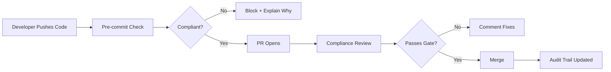

# 🛡️ Curtis Compliance

> Automated compliance workflows for fintech development teams

HIPAA, SOC2, and PCI-DSS compliance checks for every PR. Automatic audit trails. Zero manual documentation.

## Why Curtis Compliance?

**Fintech teams spend 40% of their time on compliance paperwork.**

Curtis Compliance automates the boring parts:
- ✅ Pre-commit compliance checks
- ✅ PR-level compliance gates
- ✅ Automatic audit trail generation
- ✅ Policy templates (HIPAA, SOC2, PCI-DSS)
- ✅ Documentation that writes itself

## How It Works



## Quick Start

```bash
# Install
npm install -g @curtis/compliance

# Initialize in your repo
curtis-compliance init

# Choose your compliance framework
? Select compliance framework:
  ○ HIPAA (Healthcare)
  ○ SOC2 Type II
  ● PCI-DSS (Payments)
  ○ Custom

# Commit like normal
git add .
git commit -m "feat: add payment processing"

# Curtis checks compliance automatically
✔ Curtis Compliance: PASSED
  - Data encryption verified
  - No secrets in code
  - Audit trail updated
```

## Features

### 1. Pre-commit Compliance Gates

```yaml
# .curtis/compliance.yaml
framework: pci-dss

checks:
  - no-secrets-in-code
  - encryption-at-rest
  - audit-logging-enabled
  - api-rate-limits
  - data-minimization

block_on_failure: true
```

### 2. PR Compliance Reviews

 Curtis automatically comments on PRs:

```markdown
## 🔍 Curtis Compliance Review

| Check | Status | Details |
|-------|--------|---------|
| No secrets exposed | ✅ PASS | No API keys detected |
| TLS for external calls | ✅ PASS | All HTTP requests use TLS |
| Audit logging | ❌ FAIL | Missing log for payment_events |
| Data retention | ⚠️ WARN | Consider TTL for user_data |

**Action Required:** Add audit logging for `payment_events` before merge.

[View full report →](https://curtis.ai/pr/123/compliance)
```

### 3. Automatic Audit Trails

Every change is logged automatically:

```json
{
  "timestamp": "2025-02-22T22:30:00Z",
  "event": "code_change",
  "compliance": {
    "framework": "pci-dss",
    "requirements": ["10.2", "10.3", "10.4"],
    "status": "compliant"
  },
  "changes": [
    {
      "file": "src/payments/process.py",
      "author": "jrnew",
      "commit": "abc123",
      "compliance_impact": "low"
    }
  ]
}
```

### 4. Policy Templates

**PCI-DSS Requirements:**
- 10.2: Implement audit trails
- 10.3: Record at least these audit trail entries
- 3.4: Render PAN unreadable
- 4.1: Use strong cryptography

**HIPAA Requirements:**
- 164.312(a)(1): Access controls
- 164.312(e)(1): Transmission security
- 164.308(a)(1): Risk analysis
- 164.310(d)(1): Emergency mode operation

**SOC2 Requirements:**
- CC6.1: Logical and physical access controls
- CC6.6: System configuration changes
- CC7.2: System monitoring
- CC7.3: System component change

## Installation

```bash
# CLI
npm install -g @curtis/compliance

# GitHub App (recommended)
https://github.com/apps/curtis-compliance

# Self-hosted
docker run -d \
  -v /var/run/docker.sock:/var/run/docker.sock \
  -e CURTIS_API_KEY=xxx \
  curtis/compliance:latest
```

## Roadmap

- [ ] VS Code extension
- [ ] GitLab integration
- [ ] Bitbucket integration
- [ ] Custom compliance frameworks
- [ ] Compliance report export (PDF)
- [ ] Slack/Teams notifications
- [ ] AWS/Azure/GCP policy checks

## Pricing

| Plan | Price | Features |
|------|-------|----------|
| Starter | Free | Up to 5 repos, basic checks |
| Team | $99/mo | Unlimited repos, custom policies |
| Enterprise | Custom | SSO, dedicated support, on-prem |

## License

MIT - see [LICENSE](LICENSE)

---

**Curtis Compliance** - Ship fast, stay compliant.

Built by the Curtis team · https://curtis.ai
