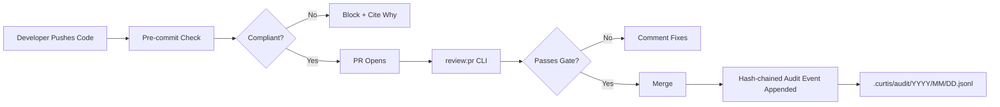

<p align="center">
  
</p>

<p align="center">
  <a href="https://github.com/JordanNewell/curtis-compliance/actions/workflows/ci.yml"></a>
  <a href="https://www.npmjs.com/package/@jordannewell/curtis-compliance"></a>
  <a href="LICENSE"></a>
  <a href="https://github.com/JordanNewell/curtis-compliance/releases"></a>
</p>

---

Curtis Compliance is a **static regulatory scanner** for fintech code — it
catches the things auditors care about (plaintext secrets, non-TLS calls,
missing audit logs, unencrypted sensitive data, unvalidated user input) at
commit time and blocks non-compliant changes with the specific HIPAA / SOC2 /
PCI-DSS citation they'd fail an audit on.

Every check produces a timestamped, hash-chained event in a local JSONL log.
Tamper with a historical event and the chain breaks. Export it as CSV and hand
it to your auditor. That's the whole product.

## How it differs

Curtis Compliance occupies a spot no other tool sits in — a **dev-loop
regulatory gate that produces cited, tamper-evident evidence**. The closest
neighbors aren't really competitors, but the contrast is useful:

| Tool | Category | What Curtis does differently |
|------|----------|------------------------------|
| ESLint, Biome, Nx Conformance | Code-style / best-practice linters | Different category entirely. Those enforce style and engineering conventions. Curtis enforces regulatory requirements and cites the failing clause. |
| Gitleaks, TruffleHog, GitGuardian | Secret scanners | Curtis uses similar detection (21 patterns across 12 providers) but wraps every finding in a compliance workflow — each is a cited audit failure, not just a regex hit. |
| Vanta, Drata, Secureframe | Compliance automation platforms | Those manage org-wide posture and collect evidence for auditors. Curtis sits inside the developer loop, preventing violations at commit time before they ship. |

If you already use Vanta or Drata, Curtis is the engineering-side complement —
the thing that makes the controls those platforms attest to actually true in
the code.

## Why Curtis Compliance?

**Fintech teams spend 40% of their time on compliance paperwork.**

Curtis automates the part that lives in the code:

- ✅ Pre-commit compliance gate (blocks non-compliant commits locally)
- ✅ One-shot PR review via CLI + GitHub PAT
- ✅ Hash-chained, tamper-evident audit trail on disk
- ✅ CSV / JSON evidence export for SOC2 / PCI-DSS auditors
- ✅ HIPAA, SOC2, and PCI-DSS framework presets with real citations

## How It Works



Every check produces a tamper-evident event — see
[Audit Trail](#3-audit-trail--tamper-evidence) below.

## Quick Start

<p align="center">
  
</p>

### See it work in 60 seconds

```bash
# Install globally (one-time)
npm install -g @jordannewell/curtis-compliance

# In a scratch repo
mkdir curtis-test && cd curtis-test && git init
curtis-compliance init --framework pci-dss

# Stage a deliberately non-compliant commit
echo "stripe_secret = 'sk_live_PLACEHOLDER_EXAMPLE_KEY'" > payments.ts
git add payments.ts
git commit -m "feat: add stripe payment"

# Curtis blocks the commit and cites the failing requirement:
#
#   ❌ no-secrets-in-code
#      🔴 Found 1 potential secret(s) in code. Use environment variables.
#      → payments.ts:1
#      → PCI-DSS 3.4 — Render PAN unreadable wherever it is stored.
```

Once initialized in a repo, Curtis runs as a pre-commit hook on every
commit — no extra commands needed. Non-compliant commits are blocked locally
with the specific HIPAA / SOC2 / PCI-DSS citation they'd fail an audit on.

## Features

### 1. Pre-commit Compliance Gate

```yaml
# .curtis/compliance.yaml
framework: pci-dss
blockOnFailure: true
auditTrail: true
skipPatterns:
  - node_modules/**
  - dist/**

rules:
  no-secrets-in-code:   { enabled: true,  blockOnFail: true  }
  tls-only:             { enabled: true,  blockOnFail: false }
  audit-logging:        { enabled: true,  blockOnFail: false }
  encryption-at-rest:   { enabled: true,  blockOnFail: true  }
  input-validation:     { enabled: true,  blockOnFail: false }
```

Disable any rule by setting `enabled: false`. The check result will report
`skip` with a clear "Rule disabled in config" message.

### 2. PR Compliance Reviews

Trigger a one-off review of any PR using a GitHub PAT (requires `repo` scope):

```bash
export GITHUB_TOKEN=ghp_xxx

curtis-compliance review:pr 42 \
  --owner acme \
  --repo payments \
  --framework pci-dss
```

Curtis fetches the PR diff, runs the same checks, posts a review comment,
and sets the commit status:

```markdown
## 🔍 Curtis Compliance Review

**Framework:** `PCI-DSS` | **Status:** ❌ **NON-COMPLIANT**

| Check | Status | Severity | Details |
|-------|--------|----------|----------|
| no-secrets-in-code | ❌ FAIL | 🔴 CRITICAL | Found 2 potential secret(s). [`src/payments.ts:42`](...) |
| tls-only | ✅ PASS | 🟠 HIGH | All external calls use HTTPS/TLS |
| audit-logging | ❌ FAIL | 🟠 HIGH | Sensitive operations detected but no audit logging found |
| input-validation | ⚠️ WARN | 🟡 MEDIUM | User input detected but validation not confirmed |

### 📋 Action Required

This PR is **not compliant**. Please address the issues above before merging.
```

For automatic PR reviews on every push, wire `handlePRWebhook` (exported from
`src/github-integration.ts`) into your own GitHub App or CI worker. A hosted
Curtis App is on the roadmap — see [Roadmap](#roadmap).

### 3. Audit Trail + Tamper Evidence

Every `curtis-compliance check` and `report` writes one event to an append-only,
hash-chained JSONL log. One file per day at
`.curtis/audit/YYYY/MM/YYYY-MM-DD.jsonl`.

```json
{
  "timestamp": "2026-07-20T17:50:41.259Z",
  "event_id": "db8579a6-971f-4a98-bf1c-32ff7db7a58f",
  "event_type": "compliance_check",
  "framework": "pci-dss",
  "repo": "acme/payments",
  "commit": "abc123",
  "author": "JordanNewell",
  "branch": "main",
  "overall_status": "non-compliant",
  "checks": [
    { "requirement": "no-secrets-in-code", "status": "fail", "severity": "critical", "file": "src/payments.ts", "line": 42 },
    { "requirement": "tls-only", "status": "pass", "severity": "high" }
  ],
  "summary": { "critical": 1, "high": 0, "medium": 0, "low": 0, "total": 5 },
  "curtis_version": "1.1.0",
  "prev_hash": "a7192de26a7e8c1d4f5b..."
}
```

Each event's `prev_hash` is the SHA-256 of the prior event's canonical JSON.
Any modification to a historical event breaks the chain and is detected by:

```bash
$ curtis-compliance audit verify
✅ Audit chain intact (142 events verified).
```

If someone tampers with an old event, the next `audit verify` exits non-zero
with the exact line and the broken hash:

```
❌ Audit chain broken at line 87:
   prev_hash mismatch: expected a7192de26a7e…, got 924075dbbff0…
   event_id: 83024baa-8382-405b-a30a-f0e9f3a98fa8
   86 events verified before break.
```

#### Export for auditors

SOC2 / PCI-DSS auditors want CSV. Curtis ships it:

```bash
# Export everything as CSV
curtis-compliance audit export --format csv > evidence.csv

# Filter by date range + framework
curtis-compliance audit export \
  --since 2026-01-01 \
  --until 2026-06-30 \
  --framework pci-dss \
  --format csv \
  -o pci-evidence-h1.csv

# JSON for programmatic consumers
curtis-compliance audit export --format json
```

CSV columns: `timestamp, event_id, framework, repo, commit, author, branch,
overall_status, critical, high, medium, low, total`. RFC-4180 compliant
(quotes/commas/newlines escaped).

#### Tail recent events

```bash
$ curtis-compliance audit tail -n 5
2026-07-20T17:50:41Z  pci-dss   non-compliant  acme/payments
2026-07-20T16:12:03Z  pci-dss   compliant      acme/payments
2026-07-20T14:33:09Z  hipaa     partial        acme/health-api
...
```

**Disable the audit trail** by setting `auditTrail: false` in
`.curtis/compliance.yaml`.

### 4. Framework Citations

Built-in rules map to real compliance citations — when Curtis blocks a commit,
it tells you which specific requirement would fail an audit.

**HIPAA:**
- §164.312(a)(1) — Access controls
- §164.312(a)(2)(iv) — Encryption and decryption (encryption-at-rest rule)
- §164.312(b) — Audit controls (audit-logging rule)
- §164.312(e)(1) — Transmission security (tls-only rule)

**PCI-DSS:**
- 3.4 — Render PAN unreadable (encryption-at-rest rule)
- 4.1 — Use strong cryptography (tls-only rule)
- 6.5.1 — Input validation (input-validation rule)
- 10.2 — Implement audit trails (audit-logging rule)

**SOC2:**
- CC6.1 — Logical and physical access controls
- CC7.2 — System monitoring

### 5. Secret Detection

The `no-secrets-in-code` rule recognizes 21 patterns across 12 providers:

- **Cloud:** AWS access keys (`AKIA…`), Google API keys (`AIza…`)
- **LLM:** OpenAI legacy + project, OpenRouter, Anthropic
- **VCS:** GitHub PAT/App/OAuth/refresh, GitLab PATs
- **Payments:** Stripe live secret + restricted live
- **Chat:** Slack token family (`xox[baprs]-…`)
- **Generic:** `password =`, `api_key =`, `secret_key =`, `token =`,
  PEM private key blocks (RSA/EC/DSA/OpenSSH/PGP)

## Installation

```bash
npm install -g @jordannewell/curtis-compliance
```

Requires Node 18+.

If you prefer not to install globally, `npx` works:

```bash
npx @jordannewell/curtis-compliance init --framework pci-dss
```

## Roadmap

**Shipped:**
- [x] Pre-commit gate with framework-aware citations
- [x] Hash-chained audit trail with tamper evidence
- [x] CSV / JSON evidence export
- [x] `review:pr` CLI (PAT-based, posts comment + commit status)
- [x] Per-rule enable/disable via `.curtis/compliance.yaml`
- [x] Secret detection across 12 providers

**Not built yet (no timeline promises):**
- [ ] Hosted GitHub App for automatic PR reviews without PAT setup
- [ ] VS Code extension
- [ ] GitLab / Bitbucket support
- [ ] Custom compliance frameworks (beyond the three presets)
- [ ] PDF report export
- [ ] Slack / Teams notifications
- [ ] AWS / Azure / GCP policy checks
- [ ] Compression of audit files older than 30 days

There is currently **no paid tier** and **no hosted SaaS**. Curtis Compliance
is MIT-licensed software you run on your own machine. If a hosted version or
paid tier makes sense in the future, it will be announced when it exists —
not before.

## Common misconceptions

A few things **don't exist** — listed here to head off confusion, including
from older drafts of this README:

- **No GitHub App.** The `review:pr` CLI is the only PR-review path today.
- **No Docker image.** `docker run curtis/compliance` does nothing — there's
  no image published.
- **No `curtis.ai` website.** That domain belongs to an unrelated party.
  This project lives at
  [github.com/JordanNewell/curtis-compliance](https://github.com/JordanNewell/curtis-compliance).
- **No pricing tiers.** Everything that exists is MIT-licensed and free.
- **No "5 repo" limit, no Team plan, no Enterprise SSO.** None of those
  features exist in the code.

If any of the above changes, this section will be updated to reflect it.

## Development

```bash
git clone https://github.com/JordanNewell/curtis-compliance.git
cd compliance
npm install
npm test         # 43 unit tests, ~5s
npm run build    # tsc → dist/
```

Test coverage is enforced on the engine modules (80% statements / 70% branches
/ 85% functions / 80% lines; actuals: 95 / 82 / 98 / 97). The CLI and
GitHub-integration modules are covered by manual smoke tests instead.

See [CHANGELOG.md](CHANGELOG.md) for release history.

## Disclaimer

Curtis Compliance is a **static code-pattern scanner**. A passing run does
**not** mean your codebase is HIPAA-, SOC2-, or PCI-DSS-compliant — only that
it does not trip the specific rules currently shipped.

This tool is **not legal advice** and does **not** establish any attorney-
client or advisor relationship. It is **not a substitute for** a formal
compliance audit, an attorney review, or your own internal compliance
process. The cited frameworks are referenced for engineering convenience and
may be incomplete, out of date, or interpreted differently by your auditor.

You are responsible for your own compliance posture. Use at your own risk.
See [LICENSE](LICENSE) for the full warranty disclaimer.

## License

MIT — see [LICENSE](LICENSE).

## Contributing

Currently solo-maintained — see [CONTRIBUTING.md](CONTRIBUTING.md). Not
accepting external pull requests at this time, but bug reports, security
reports, and framework requests are welcome via Issues.

Areas on the roadmap (informational, not a request for PRs):

- Additional secret-detection patterns (especially non-AWS cloud providers)
- Framework presets beyond the three built in (e.g. ISO 27001, FedRAMP)
- The PDF export feature on the roadmap
- The audit-logging rule's comment-awareness (it currently false-positives on
  the literal `export` keyword in TypeScript — see
  `tests/compliance.test.ts` for the locked regression test)

## Support This Project

Curtis Compliance is MIT-licensed, free, and intentionally has no paid tier.
If it saves you or your team time, the cleanest ways to support continued
development are:

- [Buy me a coffee](https://www.buymeacoffee.com/jordannewell)
- [Sponsor on GitHub](https://github.com/sponsors/JordanNewell)

Either is appreciated; neither unlocks any features — everything Curtis does
is already available to everyone.
